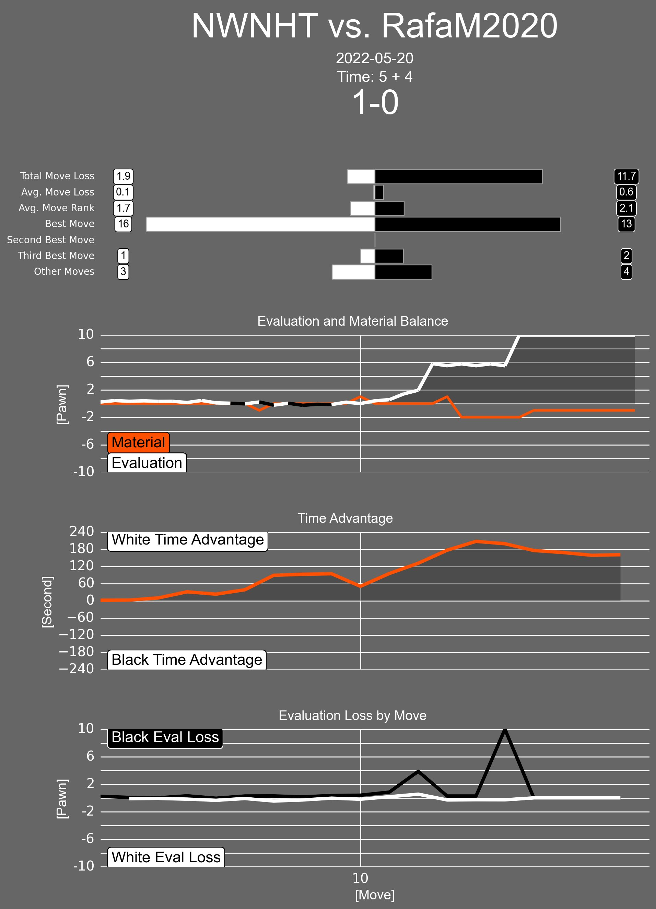

# Twitter Chess Bot

This is a bot that will periodically search #chessindata and reply with an infographic describing the chess game.

Tweets must be in the format: 
"chesscom\_id #chessindata"

# Use
This 'bot' is designed to periodically search the Twitter hashtag [#chessindata](https://twitter.com/search?q=chessindata) and respond to any new tweet of the format "`chesscom_game_id` #chessindata" with an infographic describing/summarizing the game.

The default search period is 30 seconds so accounting for the time it takes to analyze the position it may take a couple of minutes to get a reply.  Anything beyond 5 minutes means that it isn't running or something broke.

The chess.com game ID can be found in the link for the chess.com game view.  
#### Example:  
Link: [https://www.chess.com/game/live/46747178545](https://www.chess.com/game/live/46747178545)  
Game ID: 46747178545  

#### Result:


#### Interpretation:
- All evaluations are presented in units of pawns(points of material).
- The "Best Move", "Second Best Move", ... represent the count of total best moves played by each player.
- The Evaluation and Material Balance plot shows the per ply evaluation and material balance.
  - The colour of the evaluation plot will change to represent the colour of the side with the advantage.
- The Time Advantage plot shows the time difference from the perspective of the white player.
- The Evaluation Loss by Move plot shows the [pawn] evaluation lost per move, the difference between the evaluation of the best move and the move actually played.

# Installation
### Creating Conda environment
```conda create -n env_twitter_chess_bot python=3.9.13```
### Installing packages
```pip install -r requirements.txt```  
_Note:_ The package `patchworklib` currently(2022-11-26) doesn't support plotnine v10.X.X due to a simple version check.  This has been partially fixed but I have submitted a pull request to completely fix this and hopefully it is accepted soon.

# Running
The bot can be run with `python main.py` and using any of the flags included in the help text below(accessable with the `-h` flag).

```
usage: TwitterChessBot [-h] [-d DEFAULT_DEPTH] [-p POLL_PERIOD] [-m MAX_TWEET_RESULTS]

A bot to scan #chessindata and respond with an infographic.

optional arguments:
  -h, --help            show this help message and exit
  -d DEFAULT_DEPTH, --default_depth DEFAULT_DEPTH
                        set default evaluation depth in moves - Default: 15 - Range: [1, 20]
  -p POLL_PERIOD, --poll_period POLL_PERIOD
                        set period of the Twitter poll in seconds - Default: 30 - Range: [30, inf)
  -m MAX_TWEET_RESULTS, --max_tweet_results MAX_TWEET_RESULTS
                        set maximum tweets pulled in a request - Default: 10 - Range: [10, 100]
```

The first run will create a database if one doesn't exist, subsequent runs will use the same database but if some error occurs in the database then it can just be deleted and the next run will create a new database.

The bot logs some status information to stdout and creates `log.log` for all log messages.

